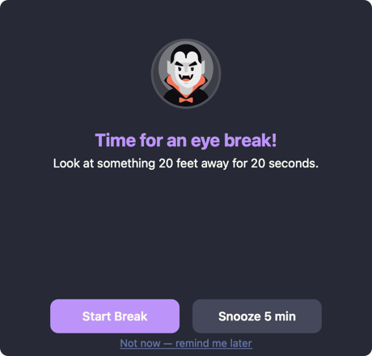
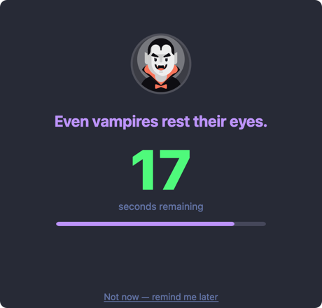
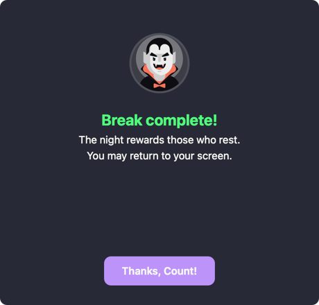

# 🧛 Count Tongula's Eye Break Reminder

**A macOS daemon that reminds you to rest your eyes every 20 minutes of active screen time.**

Follows the [20-20-20 rule](https://www.healthline.com/health/eye-health/20-20-20-rule): every **20 minutes**, look at something **20 feet** away for **20 seconds**.

<p align="center">


</p>

<p align="center">


</p>

<p align="center">

</p>

---

## Features

- **Dracula theme** — native AppKit window styled with the [Dracula](https://draculatheme.com) color palette and mascot
- **Random vampire quotes** — a different Bram Stoker-inspired quote each time
- **Smart timer** — only counts active screen time; pauses when your screen is locked or your Mac sleeps
- **Snooze support** — not ready? Snooze for 5 minutes
- **Guided countdown** — 20-second countdown with a purple progress bar
- **Runs at login** — installs as a macOS LaunchAgent

## Install

Requires Xcode Command Line Tools (`xcode-select --install`).

```bash
git clone https://github.com/alextongme/count-tongulas-eye-break.git
cd eye-break-reminder
./install.sh
```

The installer compiles the Swift UI, symlinks everything to `~/.eye-break/`, and loads the LaunchAgent. Count Tongula starts watching over your eyes immediately and on every login.

Updates are instant — just pull:

```bash
cd eye-break-reminder
git pull && ./install.sh
```

## Uninstall

```bash
cd eye-break-reminder
./uninstall.sh
```

## How It Works

```
eye_break_daemon.sh              eye_break_ui (Swift/AppKit)
┌──────────────────────┐         ┌───────────────────────────┐
│ Polls every 30s      │         │  🧛 Dracula mascot        │
│ Tracks active time   │────────>│  Random vampire quote     │
│ Pauses when locked   │         │  [Start Break] [Snooze]   │
│ Resets after sleep    │         │                           │
└──────────────────────┘         │  👁 20s countdown + bar   │
                                 │  🦇 "Break complete!"     │
                                 └───────────────────────────┘
```

**Daemon** (`eye_break_daemon.sh`) — polls every 30 seconds to check if the screen is locked, accumulates active screen time, and triggers the break every 20 minutes of active use. Resets after sleep or screen unlock.

**UI** (`eye_break_ui.swift`) — a native AppKit window with the Dracula color palette, mascot, random vampire quotes, 20-second guided countdown with progress bar, and snooze support.

## Requirements

- macOS 12+ (Monterey or later)
- Xcode Command Line Tools (for `swiftc`)
- Python 3 (pre-installed on modern macOS, used for screen lock detection)

## License

MIT — Dracula mascot artwork belongs to the [Dracula Theme](https://draculatheme.com) project.
