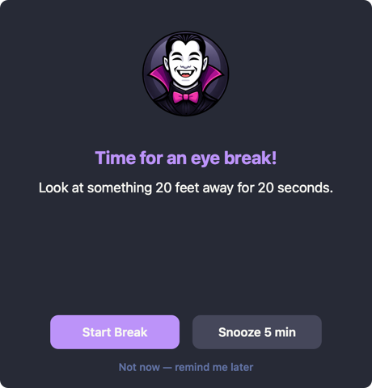
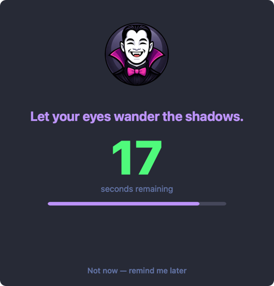
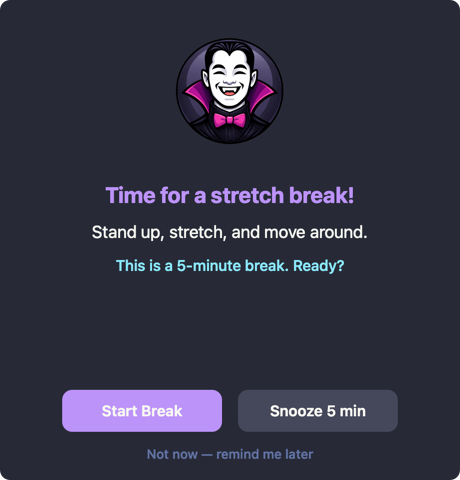
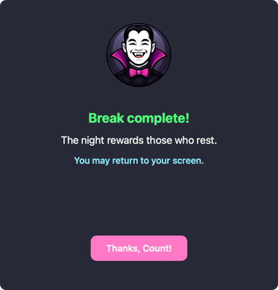
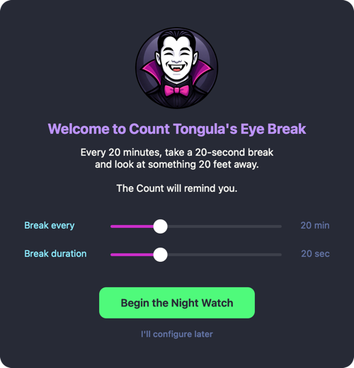
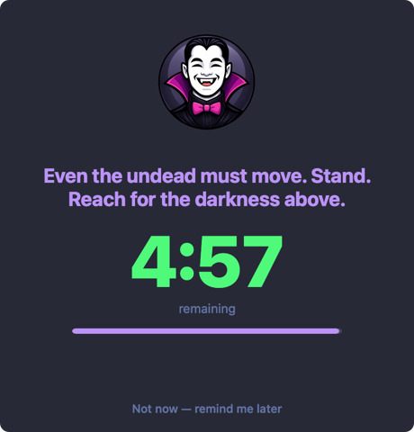

# Count Tongula's Eye Break

**A macOS menu bar app that reminds you to rest your eyes using the 20-20-20 rule.**

Every **20 minutes**, look at something **20 feet** away for **20 seconds**.

<p align="center">


</p>

<p align="center">


</p>

<p align="center">


</p>

---

## Install

### Homebrew (recommended)

```bash
brew install --cask count-tongulas-eye-break
```

### From source

Requires Xcode Command Line Tools (`xcode-select --install`).

```bash
git clone https://github.com/alextongme/count-tongulas-eye-break.git
cd count-tongulas-eye-break
./install.sh
```

The installer compiles all Swift sources, installs to `~/.eye-break/`, and loads a LaunchAgent. Count Tongula appears in your menu bar immediately and on every login.

## Uninstall

### Homebrew

```bash
brew uninstall count-tongulas-eye-break
```

### From source

```bash
./uninstall.sh
```

---

## Features

- **Menu bar app** -- 🦇 icon with live countdown to your next break
- **Dracula theme** -- native AppKit UI styled with the [Dracula](https://draculatheme.com) color palette
- **Vampire quotes** -- random Bram Stoker-inspired quotes during breaks
- **Smart timer** -- pauses when your screen is locked, Mac sleeps, or Focus/DND is active
- **Idle detection** -- resets the timer when you're already away from the keyboard
- **Long breaks** -- every N eye breaks, triggers a longer stretch break
- **Multi-monitor** -- optional fullscreen dim overlay on all connected screens
- **Configurable** -- adjust intervals, durations, sounds, and behavior from the Settings panel
- **Sound customization** -- 14 macOS system sounds with live preview
- **Global shortcuts** -- trigger a break or pause from anywhere
- **Statistics** -- tracks breaks completed, skipped, snoozed, with streak tracking and milestone titles
- **Onboarding** -- first-run welcome screen with the 20-20-20 rule explanation
- **Launch at login** -- runs automatically via macOS LaunchAgent

## Screenshots

### Onboarding

<p align="center">

</p>

### Settings

<p align="center">

</p>

### Eye Break

<p align="center">


</p>

### Long Break

<p align="center">


</p>

---

## Keyboard Shortcuts

| Shortcut | Action |
|----------|--------|
| `Cmd + Shift + B` | Take a break now |
| `Cmd + Shift + P` | Pause / resume timer |

## Configuration

Open **Settings** from the menu bar dropdown.

### Timing

| Setting | Range | Default |
|---------|-------|---------|
| Break interval | 5 - 60 min | 20 min |
| Break duration | 5 - 60 sec | 20 sec |
| Snooze duration | 1 - 10 min | 5 min |

### Sounds

| Setting | Default |
|---------|---------|
| Sound enabled | On |
| Prompt sound | Sosumi |
| Complete sound | Blow |

### Behavior

| Setting | Default |
|---------|---------|
| Pause during DND | On |
| Detect inactivity | On |
| Dim screens on break | On |
| Launch at login | On |

### Long Breaks

| Setting | Default |
|---------|---------|
| Long breaks enabled | On |
| Frequency | Every 3 eye breaks |
| Duration | 5 min |

All settings persist via `UserDefaults` and take effect immediately.

## Statistics

Count Tongula tracks your devotion. Stats are stored in `~/Library/Application Support/CountTongula/statistics.json` and retained for 30 days.

- Breaks completed, skipped, and snoozed per day
- Approval rating (completed / total)
- Streak tracking with milestone titles:

| Streak | Title |
|--------|-------|
| 5 | Familiar |
| 10 | Servant of the Night |
| 25 | Thrall |
| 50 | Considered for Immortality |
| 100 | Order of Count Tongula |

## Architecture

Single binary compiled from `scripts/Sources/*.swift` using `swiftc`. No external dependencies.

```
scripts/Sources/*.swift  -->  eye_break_ui (single binary, swiftc -O)
                              |
                              +-- NSStatusItem (menu bar 🦇 + countdown)
                              +-- BreakWindowController (eye + long breaks)
                              +-- SettingsWindowController (two-column prefs)
                              +-- OnboardingController (first-run setup)
                              +-- IdleDetector (CGEventSource, IOKit, DND)
                              +-- Statistics (JSON persistence, streaks)
                              +-- SoundManager (14 macOS system sounds)
                              +-- Preferences (UserDefaults)
```

## Releasing

Tag a version and push — GitHub Actions handles the rest (builds the `.app`, creates a GitHub Release, and updates the Homebrew Cask formula).

```bash
git tag v0.3.0
git push --tags
```

**One-time setup:** the workflow needs a `CASK_PAT` repository secret with write access to `alextongme/homebrew-cask`. See [GitHub fine-grained tokens](https://github.com/settings/tokens?type=beta).

## Requirements

- macOS 12+ (Monterey or later)
- Xcode Command Line Tools (for building from source only)

## License

MIT
